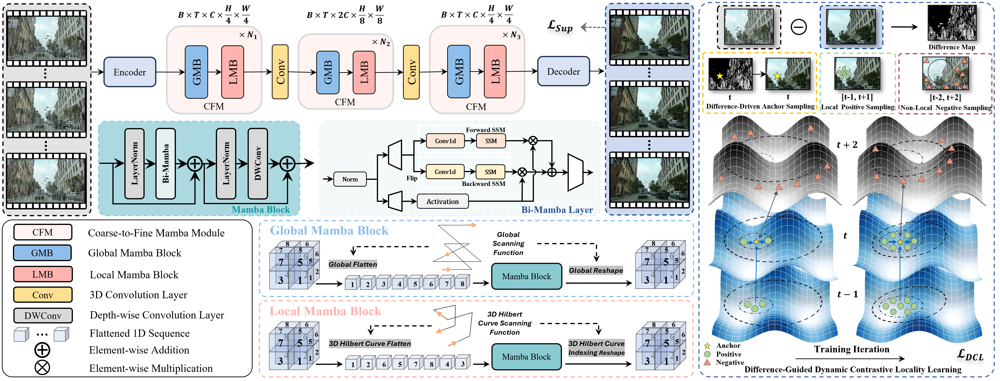
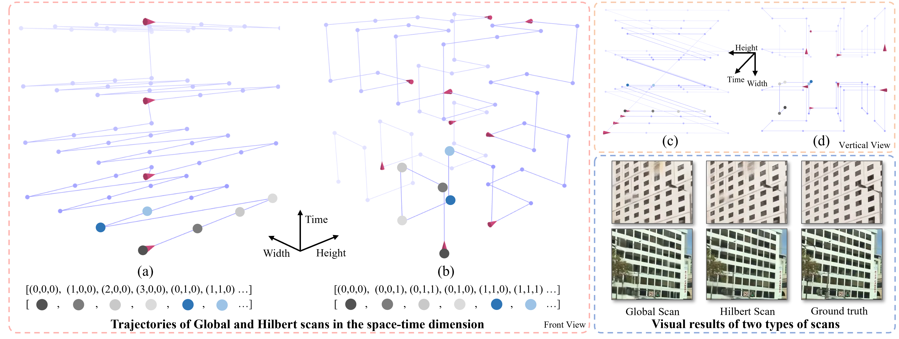
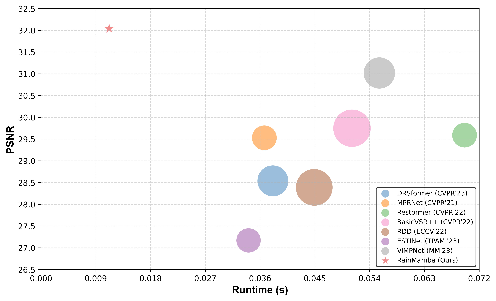

[](https://paperswithcode.com/sota/video-deraining-on-vrds?metric=PSNR)

<div align="center">
  <h1> :umbrella: RainMamba [ACM MM'24 Oral] </h1>
  
  <h2>RainMamba: Enhanced Locality Learning with State Space Models <br> for Video Deraining</h2>
</div>

<p align="center">Hongtao Wu, Yijun Yang, Huihui Xu, Weiming Wang, Jinni Zhou, Lei Zhu<sup>:email:</sup></p>
<p align="center"> 
   <a href="https://arxiv.org/abs/2407.21773">ArXivPreprint</a>  | 
  <a href="https://openreview.net/forum?id=SQreBrpK2c">OpenReview</a> 
</p>


This repository is the official implementation of the paper titled '[RainMamba: Enhanced Locality Learning with State Space Models for Video Deraining](https://arxiv.org/abs/2407.21773)'. 

RainMamba achieves state-of-the-art results on multiple video deraining benchmarks with 3D Hilbert scanning mechanism, offering superior computational efficiency and enhanced restoration quality.

If you like this work, please give us a star ⭐ on GitHub.

<hr />

<p align="justify">
<b>Abstract:</b> <i>The outdoor vision systems are frequently contaminated by rain streaks and raindrops, which significantly degenerate the performance of visual tasks and multimedia applications. The nature of videos exhibits redundant temporal cues for rain removal with higher stability. Traditional video deraining methods heavily rely on optical flow estimation and kernel-based manners, which have a limited receptive field. Yet, transformer architectures, while enabling long-term dependencies, bring about a significant increase in computational complexity. Recently, the linear-complexity operator of the state space models (SSMs) has contrarily facilitated efficient long-term temporal modeling, which is crucial for rain streaks and raindrops removal in videos. Unexpectedly, its uni-dimensional sequential process on videos destroys the local correlations across the spatio-temporal dimension by distancing adjacent pixels. To address this, we present an improved SSMs-based video deraining network (RainMamba) with a novel Hilbert scanning mechanism to better capture sequence-level local information. We also introduce a difference-guided dynamic contrastive locality learning strategy to enhance the patch-level self-similarity learning ability of the proposed network. Extensive experiments on four synthesized video deraining datasets and real-world rainy videos demonstrate the superiority of our network in the removal of rain streaks and raindrops.</i>
</p>

<hr />


### • Framework



### • Spatio-temporal scanning mechanisms




### • Model efficiency and effectiveness




## 📧 News
- **Jul. 30, 2024:** Codes of RainMamba (including the training, testing code, pretrained model and results of four video deraining datasets) are released :koala:
- **Jul. 21, 2024:** RainMamba is accepted with high scores (AR: 5.5) and selected as an Oral presentation  (3.97%) :tada:
- **Apr. 14, 2024:** RainMamba is submitted to ACM MM 2024 :kangaroo:


## :bookmark_tabs: Contents
- [Environment Installation](#environment-installation)
- [Datasets Preparation and Pretrained Models](#datasets-preparation-and-pretrained-models)
- [Training](#training)
- [Testing](#testing)
- [Results](#results)
- [Citation](#citation)
- [Acknowledgement](#acknowledgement)
- [License](#license)

<h2 id="environment-installation">🔨 Environment Installation</h2>

This implementation is based on [MMEditing](https://github.com/open-mmlab/mmediting),
which is an open-source image and video editing toolbox.

Below are quick steps for installation.

**1️⃣**
Make conda environment and install PyTorch following [official instructions](https://pytorch.org/get-started/locally/).

```shell
conda create -n RainMamba python=3.9
conda activate RainMamba
```

```shell
conda install pytorch==2.1.1 torchvision==0.16.1 torchaudio==2.1.1 pytorch-cuda=12.1 -c pytorch -c nvidia
```

**2️⃣**
Install MMCV with [MIM](https://github.com/open-mmlab/mim).

```shell
pip3 install openmim timm
mim install mmcv-full==1.7.2
```

**3️⃣**
Install RainMamba from source.

```shell
git clone https://github.com/TonyHongtaoWu/RainMamba.git
cd RainMamba/code/VRDS
pip3 install -e .
```

Please refer to [MMEditing Installation](https://github.com/open-mmlab/mmediting/blob/master/docs/en/install.md) for more detailed instruction.

**4️⃣** 
Install Bi-Mamba layer


#### Install causal-conv1d

```bash
cd causal-conv1d

python setup.py install
```

#### Install mamba

```bash
cd ../mamba

python setup.py install
```


<h2 id="datasets-preparation-and-pretrained-models">🚀 Datasets Preparation and Pretrained Models</h2>

Download four datasets from their websites and modify the training dataset path in the [config](./code/VRDS/configs/derainers/RainMamba/VRDS.py) file of each dataset code.


| Dataset          | Source         |  Description          | Dataset Link        |  Pretrained Model    | 
|------------------|----------------------|----------------------|---------------------------------|---------------------------------| 
| **VRDS**         | ACM MM 2023        |Rain streaks and raindrops dataset         | [Download](https://github.com/TonyHongtaoWu/ViMP-Net)   | [Download](https://drive.google.com/file/d/1iIkImRsHLYOdeSNvCRlm3SZvWilknF5c/view?usp=drive_link)    | 
| **LWDDS**        | ICRA 2023         |Raindrops dataset        | [Download](https://github.com/csqiangwen/Video_Waterdrop_Removal_in_Driving_Scenes)       |  [Download](https://drive.google.com/file/d/1kKrwo5n5W2ELWwMsLlpjjUkpKiCjiIO-/view?usp=drive_link)    | 
| **RainVID&SS**    | TIP 2023         |Rain streaks dataset    | [Download](https://github.com/sunsean21/Event-Aware-Video-Deraining)                      |  [Download](https://drive.google.com/file/d/1I018fVlH6BYkytbukhFRWSXDa_lGZ5k2/view?usp=drive_link)    | 
| **RainSynAll100**| TPAMI 2021         |Rain streaks dataset| [Download](https://github.com/flyywh/Recurrent-Multi-Frame-Deraining)                     |   [Download](https://drive.google.com/file/d/1ZepKftAvBVh3OPK2D01pXqnOeKY0XAbC/view?usp=drive_link)    | 


<h2 id="training">🏋️ Training</h2>

:pushpin: You can train RainMamba on these datasets using the below commands with 4 GPUs:

**1️⃣ VRDS dataset** 


```shell
cd code/VRDS
CUDA_VISIBLE_DEVICES=0,1,2,3 bash ./tools/dist_train.sh configs/derainers/RainMamba/VRDS.py 4
```

**2️⃣ LWDDS dataset** 

```shell
cd code/LWDDS
CUDA_VISIBLE_DEVICES=0,1,2,3 bash ./tools/dist_train.sh configs/derainers/RainMamba/Waterdrop.py 4
```

**3️⃣ RainVID&SS dataset** 


```shell
cd  code/RainVIDSS
CUDA_VISIBLE_DEVICES=0,1,2,3 bash ./tools/dist_train.sh configs/derainers/RainMamba/RainVIDSS.py 4
```


**4️⃣ RainSynAll100 dataset** 


```shell
cd code/RainSynAll100
CUDA_VISIBLE_DEVICES=0,1,2,3 bash ./tools/dist_train.sh configs/derainers/RainMamba/RainSynAll100.py 4
```


<h2 id="testing">⚡ Testing</h2>

:pushpin: Modify the path of pretrained model and the testing dataset in the [config](./code/VRDS/configs/derainers/RainMamba/VRDS.py) file of each dataset code.

### 
You can use the following command with 1 GPU to test your trained model `xxx.pth`:

**1️⃣  VRDS dataset** 


```shell
cd code/VRDS
CUDA_VISIBLE_DEVICES=0 bash ./tools/dist_test.sh configs/derainers/RainMamba/VRDS.py "VRDS.pth" 1 --save-path '../results/VRDS/'
```


**2️⃣ LWDDS dataset** 

```shell
cd code/LWDDS
CUDA_VISIBLE_DEVICES=0 bash ./tools/dist_test.sh configs/derainers/RainMamba/Waterdrop.py "LWDDS.pth" 1 --save-path '../results/LWDDS/'
```


**3️⃣ RainVID&SS dataset** 


```shell
cd  code/RainVIDSS
CUDA_VISIBLE_DEVICES=0 bash ./tools/dist_test.sh configs/derainers/RainMamba/RainVIDSS.py "RainVIDSS.pth" 1 --save-path '../results/RainVIDSS/'
```


**4️⃣ RainSynAll100 dataset** 


```shell
cd code/RainSynAll100
CUDA_VISIBLE_DEVICES=0 bash ./tools/dist_test.sh configs/derainers/RainMamba/RainSynAll100.py "RainSynAll100.pth" 1 --save-path '../results/RainSynAll100/'
```


<h2 id="results">📊 Results</h2>

RainMamba achieved state-of-the-art on four video deraining datasets. 


### Quantitative comparisons


<details>
<summary><strong>VRDS dataset</strong> (click to expand)</summary>

| Methods              | CCN  | PreNet  | DRSformer  | MPRNet  | Restormer  | S2VD  | SLDNet  | ESTINet  | RDD  | RVRT  | BasicVSR++  | ViMP-Net  | **Ours**          |
|----------------------|------|---------|------------|---------|------------|-------|---------|----------|------|-------|--------------|-----------|----------------|
| **PSNR** $\uparrow$  | 23.75| 27.13   | 28.54      | 29.53   | 29.59      | 18.95 | 23.65   | 27.17    | 28.39| 28.24 | 29.75        | _31.02_   | **32.04**     |
| **SSIM** $\uparrow$  | 0.8410| 0.9014  | 0.9075     | 0.9175  | 0.9206     | 0.6630| 0.8736  | 0.8436   | 0.9096| 0.8857| 0.9171       | _0.9283_  | **0.9366**    |
| **LPIPS** $\downarrow$| 0.2091| 0.1266 | 0.1143     | 0.0987  | 0.0925     | 0.2833| 0.1790   | 0.2253   | 0.1168| 0.1438| 0.1023       | _0.0862_  | **0.0684**    |

</details>


<details>
<summary><strong>RainVID&SS dataset</strong> (click to expand)</summary>

**ImageNet-VID+**  

| Methods        | MSCSC | FastDrain | PReNet | S2VD | MPEVNet | **Ours** |
|----------------|-------|-----------|--------|------|---------|----------|
| **PSNR** $\uparrow$ | 18.41 | 17.08 | 24.73 | 29.92 | _33.83_ | **35.07** |
| **SSIM** $\uparrow$ | 0.5148 | 0.4381 | 0.7393 | 0.9228 | _0.9452_ | **0.9561** |

**Cam-Vid+**  

| Methods        | MSCSC | FastDrain | PReNet | SLDNet | S2VD | MPEVNet | **Ours** |
|----------------|-------|-----------|--------|--------|------|---------|----------|
| **PSNR** $\uparrow$ | 21.22 | 19.94 | 25.33 | 18.97 | 29.11 | _32.55_ | **32.65** |
| **SSIM** $\uparrow$ | 0.5515 | 0.4830 | 0.7647 | 0.6267 | 0.8899 | _0.9234_ | **0.9328** |

</details>


<details>
<summary><strong>RainSynAll100 dataset</strong> (click to expand)</summary>

| Methods         | FastDerain | FCRVD | RMFD | BasicVSR++ | NCFL | SALN | **Ours** |
|-----------------|------------|-------|------|------------|------|------|----------|
| **PSNR**  $\uparrow$      | 17.09      | 21.06 | 25.14| 27.67      | 28.11| _29.78_| **32.16**|
| **SSIM**  $\uparrow$      | 0.5824     | 0.7405| 0.9172| 0.9135    | 0.9235| _0.9315_| **0.9446**|

</details>


<details>
<summary><strong> LWDDS dataset</strong> (click to expand)</summary>

| Methods         | CCN | Vid2Vid | VWR | BasicVSR++ | ViMP-Net | SALN | **Ours** |
|-----------------|-----|---------|-----|------------|----------|------|----------|
| **PSNR** $\uparrow$  | 27.53 | 28.73 | 30.72 | 32.37 | 34.22 | _36.57_ | **37.21** |
| **SSIM** $\uparrow$  | 0.922 | 0.9542 | 0.9726 | 0.9792 | 0.9784 | _0.9802_ | **0.9816** |

</details>

<details>
<summary><strong> NTURain dataset</strong> (click to expand)</summary>
  
| Method  | MSCSC | J4RNet | SPAC | FCRNet | SLDNet | MPRNet | S2VD | ESTINet | Ours |
|---------|-------|--------|------|--------|--------|--------|------|---------|------|
| **PSNR**$\uparrow$ | 27.31  | 32.14 | 33.11 | 36.05 | 34.89 | 36.11 | 37.37 | 37.48  | **37.87** |
| **SSIM**$\uparrow$ | 0.7870 | 0.9480 | 0.9474 | 0.9676 | 0.9540 | 0.9637 | 0.9683 | 0.9700  | **0.9738** |

</details>

### Qualitative comparisons

<details>
<summary><strong>VRDS dataset</strong> (click to expand)</summary>

<div align="center">
  
</div>

</details>

<details>
<summary><strong>Other datasets</strong> (please refer to the supplementary materials)</summary>


</details>

### All visual results can be downloaded here.

| Dataset          |  Link :file_folder:                                                                      |  Link :open_file_folder:                                                                      |
|------------------|------------------------------------------------------------------------------------------|---------------------------------------------------------------------------------------|
| **VRDS**         | [Google Drive](https://drive.google.com/file/d/1dZu2Zn0PPNHbyAvJc2isbXbr3aMHaPYK/view?usp=drive_link)                                 | [OneDrive](https://hkustgz-my.sharepoint.com/:f:/g/personal/hwu375_connect_hkust-gz_edu_cn/EtfqIwKket5NimQZGGSxxmUBWBCOVXJrKxRXg7sPRh6s9w?e=aWckaw)                                 |
| **LWDDS**        | [Google Drive](https://drive.google.com/file/d/1NXfjkdR4FOBMrujMARQvaC_anjP1EVsV/view?usp=drive_link)   | [OneDrive](https://hkustgz-my.sharepoint.com/:f:/g/personal/hwu375_connect_hkust-gz_edu_cn/Ep18opx9I1BNmFcVZYq_QPoBTyAQk8w4QjGB3NTa5lFamw?e=ck07bs)   |
| **RainVID&SS**    | [Google Drive](https://drive.google.com/file/d/1q7AL8vjoEP1SETLyES4bzTV1YQr2joZa/view?usp=drive_link)                  | [OneDrive](https://hkustgz-my.sharepoint.com/:f:/g/personal/hwu375_connect_hkust-gz_edu_cn/Ele2i_Rf8D5PunqYs3837KEBaL1cM-sasiTVFoirQvY_cQ?e=xrOWJa)                  |
| **RainSynAll100**| [Google Drive](https://drive.google.com/file/d/1ljRbqgpUdN-4he5bLqtiMp-i-tV1TDYT/view?usp=drive_link)                 | [OneDrive](https://hkustgz-my.sharepoint.com/:f:/g/personal/hwu375_connect_hkust-gz_edu_cn/EosjvMAr64BDrhhMbbwlbIQB65jgVFTN-6W3G8EMXE0J7Q?e=gZ2TTT)                 |
| **NTURain**| [Google Drive](https://drive.google.com/file/d/1Yt_0k_OVrBkC1n_F8SeOz_9V160o9UOc/view?usp=sharing)                 | [OneDrive](https://hkustgz-my.sharepoint.com/:f:/g/personal/hwu375_connect_hkust-gz_edu_cn/ElAZl-2NbL5InoSvTd-hUygBm7maZTEB7tqA76jKI1pLew?e=rBIlhf)                 |


### Real-world visual results

https://private-user-images.githubusercontent.com/141260395/365448327-36b19ed6-5f54-42cd-ba6c-49c1d0ad7328.mp4


<h2 id="citation">🎓 Citation</h2>

If you find this repository helpful to your research, please consider citing the following:
```
@article{wu2024rainmamba,
  title={RainMamba: Enhanced Locality Learning with State Space Models for Video Deraining},
  author={Wu, Hongtao and Yang, Yijun and Xu, Huihui and Wang, Weiming and Zhou, Jinni and Zhu, Lei},
  journal={arXiv preprint arXiv:2407.21773},
  year={2024}
}
```
If you have any questions or suggestion about our project, please feel free to contact us by email at hwu375@connect.hkust-gz.edu.cn.


<h2 id="acknowledgement">🤗 Acknowledgement</h2>

This code is based on [MMEditing](https://github.com/open-mmlab/mmagic), [Vim](https://github.com/hustvl/Vim), [Vivim](https://github.com/scott-yjyang/Vivim) , [gilbert](https://github.com/jakubcerveny/gilbert), [LGRNet](https://github.com/bio-mlhui/lgrnet). Thank them for their outstanding work. 

Thank Huihui Xu and Yijun Yang for their help in this work.

<h2 id="license">🎫 License</h2>

This project is released under the MIT license. Please refer to the acknowledged repositories for their licenses.

